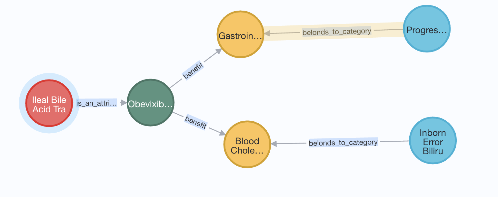

Drug-Events-To-Turtle
=================================================


## About Drug-Events-To-Turtle
OpenFDA is a platform created by the United States Food and Drug Administration (FDA) to make publicly available data more accessible to the public. This includes data on drug adverse events, product recalls, and more. FAERS is a database of adverse event and medication error reports submitted to the FDA. The information in FAERS is used by the FDA to monitor drug safety, and detect and understand new safety concerns. The scripts in this repository will incorporate information from OpenFDA's FAERS API into a turtle file and import it into neo4j.

Table of Contents
-----------------
* [Usage](#usage)
* [Describe Script](#usage)
* [Authors and history](#authors-and-history)
* [Acknowledgments](#acknowledgments)
* [References](#references)

## Usage
1. Clone the repository
```bash
git clone 'https://github.com/beagan-svg/Drug-Events-To-Turtle'
```
2. Install the necessary Python packages using these commands
```bash
import requests
import os
import json
import pandas as pd
import pprint
import os
import pickle5 as pickle
import string
from nltk.corpus import stopwords
from nltk.tokenize import word_tokenize
from sklearn.feature_extraction.text import TfidfVectorizer
from sklearn.svm import LinearSVC
from sklearn.pipeline import Pipeline
from sklearn.model_selection import train_test_split
from sklearn.metrics import classification_report
import spacy
import numpy as np
from scipy.sparse import hstack
```

3. Run the Script.
```bash
python3 <File Name>
``` 

4. 
## Authors and History

* Beagan Nguy - Algorithm Design

## Acknowledgments

BrightSeed


